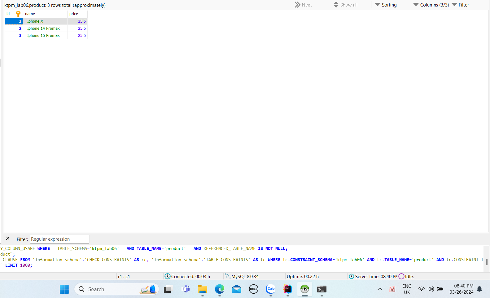
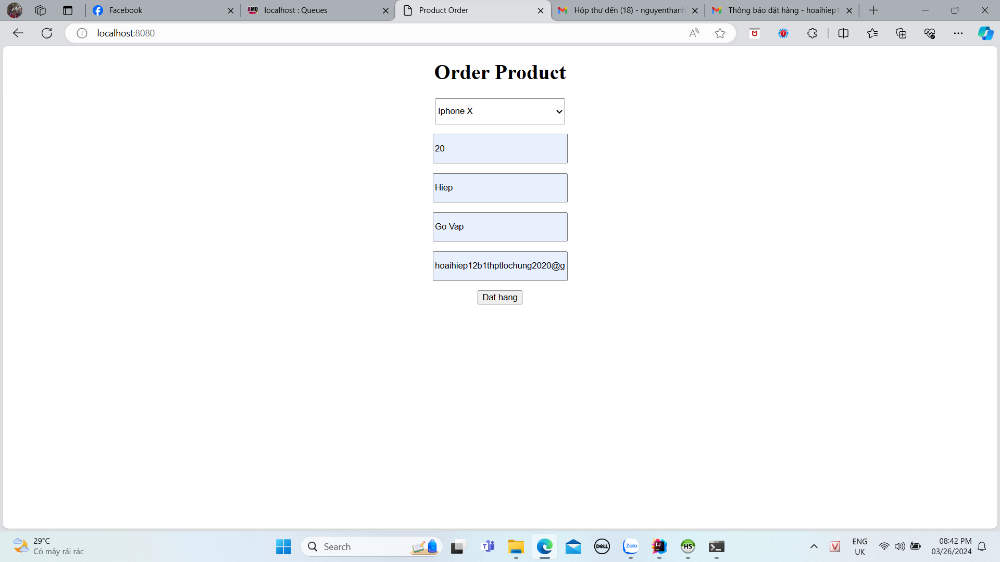
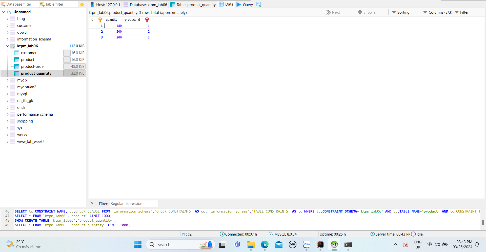
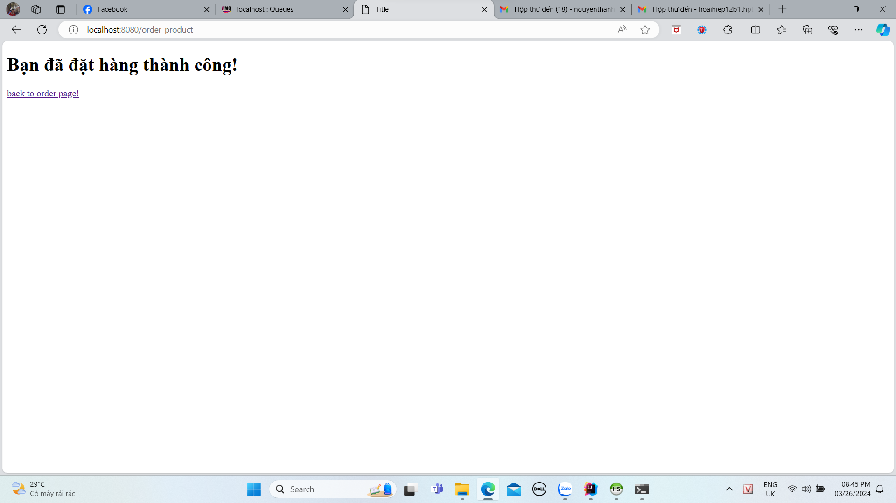
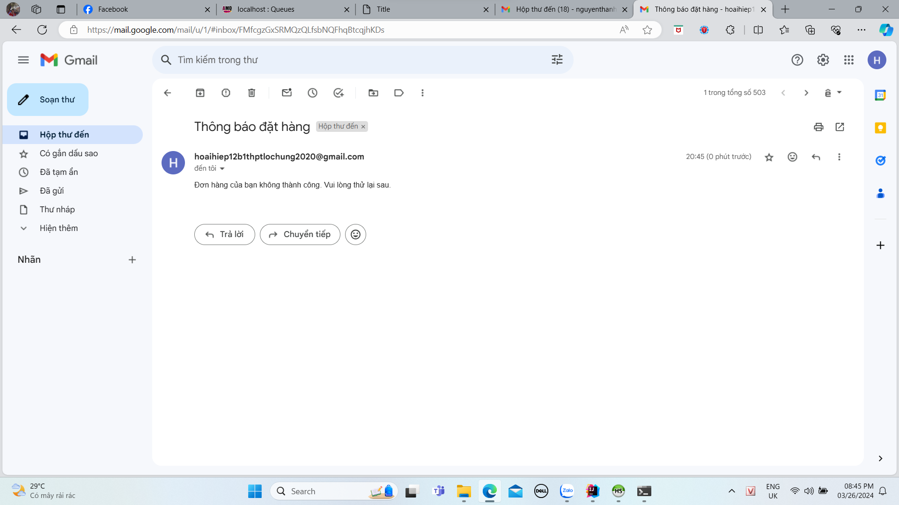
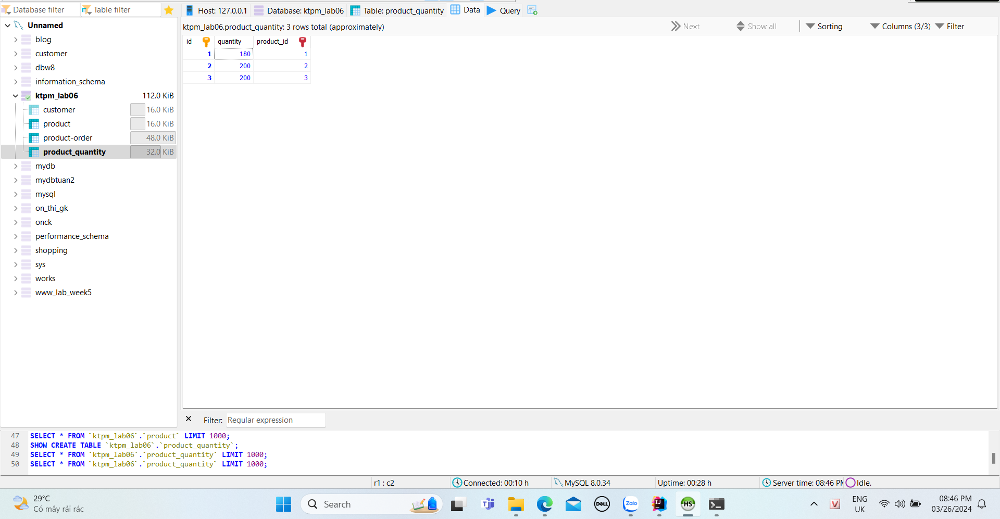
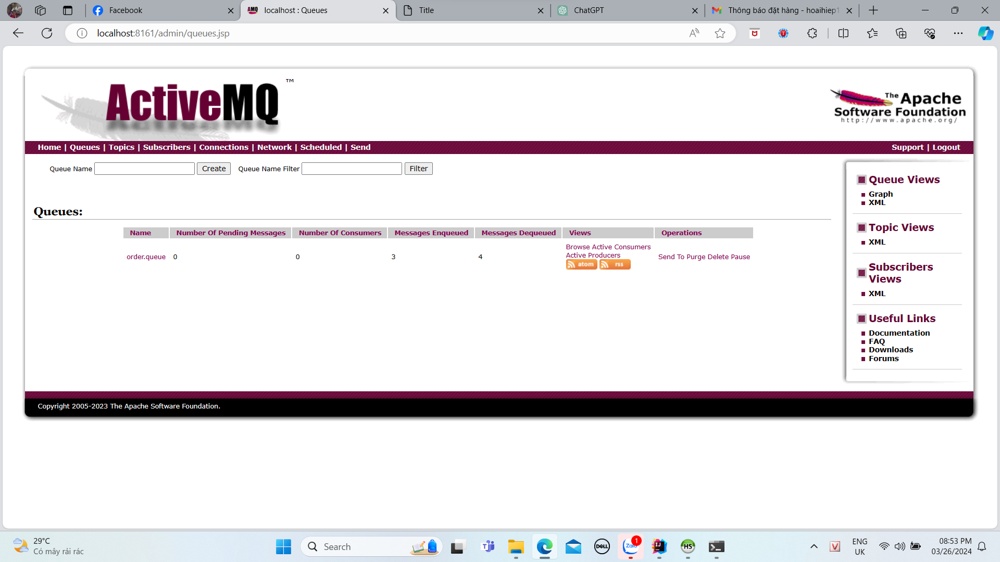

20111601-Phan Nguyễn Hoài Hiệp

=====Minh chứng=====

1. số lượng sản phẩm trước khi đặt(tất cả đều là 200):
   
   
2. sau khi đặt hàng trong số lượng cho phép.
   
   kết quả trong csdl:
   
   email được gửi về để xác nhận đơn hàng:
   
3. khi đặt hàng quá số lượng có trong kho:
   
   
   email gửi về khi đặt quá số lượng có trong kho:
   
   số lượng trong kho không thay đổi:
    
4. Thông tin trên activeMQ:
    

